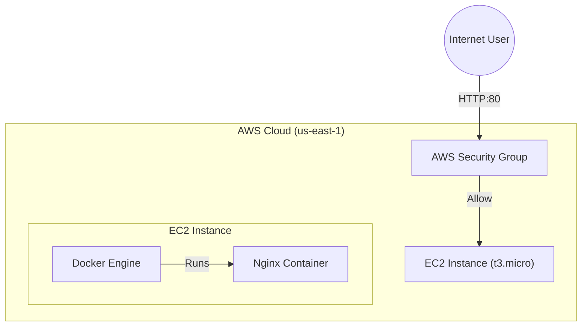
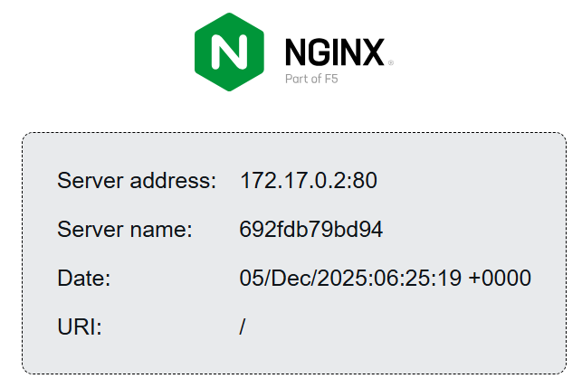

# Automated Cloud Infrastructure Deployment with Terraform & GitHub Actions

## 📋 Project Overview
This project demonstrates a production-ready **Infrastructure as Code (IaC)** pipeline designed to deploy a containerized application on AWS. It showcases the automation of cloud resource provisioning, network security configuration, and application deployment using industry-standard DevOps tools.

**Goal:** To simulate a real-world scenario where infrastructure is versioned, auditable, and immutable.

---

## 🏗 Architecture

The project provisions a Linux server (Ubuntu) on AWS, configures a firewall (Security Group), and automatically bootstraps a Docker container running Nginx.

---

## 📸 Proof of Concept
The application is automatically deployed and accessible via the public internet immediately after the pipeline finishes.

---

## 🛠 Technologies Used

* **Cloud Provider:** AWS (Amazon Web Services)
* **Infrastructure as Code:** Terraform
* **CI/CD:** GitHub Actions
* **Containerization:** Docker
* **OS:** Linux (Ubuntu 22.04 LTS)
* **Version Control:** Git

## 🚀 How It Works

1.  **Trigger:** A push to the `main` branch triggers the GitHub Actions pipeline.
2.  **Provision:** Terraform authenticates with AWS and provisions the VPC network rules and EC2 instance.
3.  **Bootstrap:** User Data scripts (Bash) install Docker and launch the application container upon instance initialization.
4.  **Verify:** The application becomes accessible via the instance's Public IP.

## ⚠️ Challenges & Solutions

* **Free Tier Compliance:** Adapted the instance type from `t2.micro` to `t3.micro` to align with the latest AWS Free Tier eligibility in the us-east-1 region.
* **State Management:** Managed Terraform state limitations within a CI/CD ephemeral environment by ensuring clean resource destruction and manual conflict resolution when necessary.

## 🔮 Future Improvements
To elevate this project to a production-grade enterprise environment, the following steps would be implemented:

1.  **Remote State Management:** Configure AWS S3 backend with DynamoDB locking for Terraform state to allow team collaboration and prevent state drifts.
2.  **HTTPS/SSL:** Use AWS Certificate Manager (ACM) and an Application Load Balancer (ALB) to serve traffic securely over HTTPS (Port 443).
3.  **High Availability:** Deploy instances across multiple Availability Zones (AZs) using an Auto Scaling Group to ensure uptime.
4.  **Configuration Management:** Replace bash `user-data` scripts with **Ansible** playbooks for more robust and idempotent server configuration.

---

## 👤 Author
**Icaro Barros**
* [Connect on LinkedIn](https://www.linkedin.com/in/icarojsbarros/)
